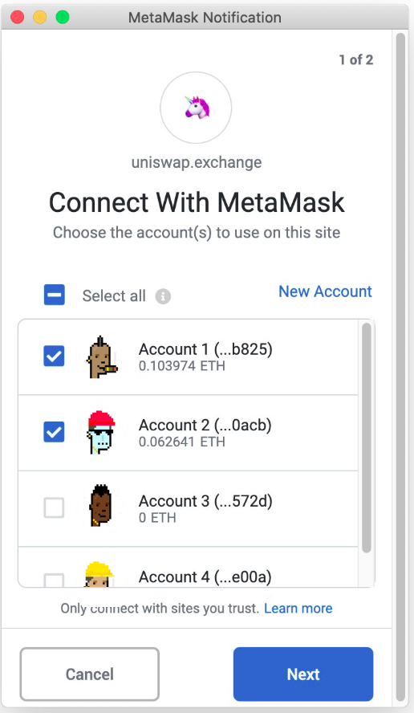

# Punk identicons

Punk identicons allow you to generate punks based on a random number.

Built on Punk-blocks, this contract implements a punk-picking function.

The generator contract is deployed to: [0x69058dc511d5dd3117ebfaa08036b698d5cb2707](https://etherscan.io/address/0x69058dc511d5dd3117ebfaa08036b698d5cb2707#code)

Punk identicons are returned as SVG images.

Bonus feature: rare faces depending on the amount of leading zeros in the 160-bit random number.

## Why?


Use randomly generated punks from your wallet address to automatically identify each account. The screenshot is a mockup to show what I mean... Which one is better?

Before:


After:



### Limitations

The generator does not check for duplicates. To reduce the possibility
of duplicates, add more traits and spread the probabilities of the traits
evenly. The function that calls the generator can also check for duplicates.

## Configuration

Use the `setConfig` to set a new configuration.

Example using ethers js.

The following example adds two super-rare faces, needing 7 or 8 leading zeros, 2 regular bases to choose from, 4 large traits to choose from, and 4 small trairs to chose from.

```javascript

let getKey = function (s) {
    return ethers.utils.keccak256(ethers.utils.hexlify(ethers.utils.toUtf8Bytes((s))));
}

let srare = [
    //
    {"hash": getKey("Killer Bot"), "sample": 7, "list" : 0},
    {"hash": getKey("Killer Botina"), "sample": 8, "list" : 0}
];


let base = [
    {"hash": getKey("Male 1"), "sample": 8000, "list" : 0},
    {"hash": getKey("Male 2"), "sample": 8000, "list" : 0}
];

let large = [
    {"hash": getKey("Rosy Cheeks"), "sample": 50000, "list" : 0},
    {"hash": getKey("Luxurious Beard"), "sample": 2860, "list" : 0},
    {"hash": getKey("Clown Hair Green"), "sample": 1480, "list" : 0},
    {"hash": getKey("Mohawk Dark"), "sample": 4290, "list" : 9}
];

let small = [
    {"hash": getKey("Pilot Helmet"), "sample": 540, "list" : 0},
    {"hash": getKey("Tassle Hat"), "sample": 1780, "list" : 0},
    {"hash": getKey("Hot Lipstick"), "sample": 33333, "list" : 0},
    {"hash": getKey("Blue Eye Shadow"), "sample": 2660, "list" : 0}];

await id.setConfig(
    srare,
    base,
    large,
    small,
    100000
);

```

### Adding new traits

You can add new traits by using [Punk Blocks](https://github.com/0xTycoon/punk-blocks)

### Generate


#### Solidity Interface

```solidity
/**
* @dev generates a punk, picking traits using a random seed
* @param _a the random seed
* @param _cid the config id
*/
function generate(
    address _a,
    uint64 _cid) view external returns (string memory);
```

#### ethers js

```javascript
let punk = await id.generate(owner.address, 0);
            console.log(punk);
```

### Address mining estimations

The super-rare faces are decided by the amount of leading zeros in front of
the random number given. If these were Ethereum addresses, here's how long
it would take to mine these:

(for a GPU based miner)

2^(4*N) hashes, where n is number of 0
(2^(4*14) / 350000000) seconds to years

N = number of leading zeros
350000000 = 350 Megahashes (MH)

17 = 26,722 years
16 = 1,670 years
15 = 104 years
14 = 6.5 years
13 = 0.4 years
12 = 1.3 weeks
11 = 14 hours
10 = 0.9 hours

The above is for 1 GPU. Someone with 1000 GPUs may
take significantly faster.